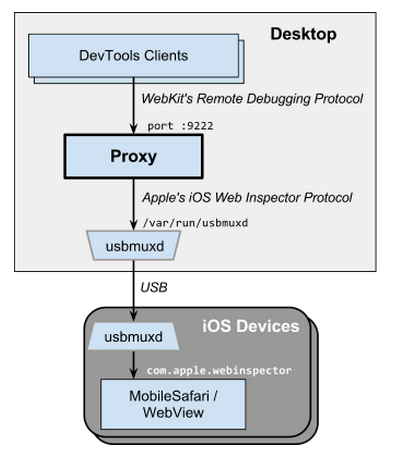

# iOS WebKit Debug Proxy

The ios_webkit_debug_proxy (aka _iwdp_) proxies requests from usbmuxd daemon over a websocket connection, allowing developers to send commands to MobileSafari and UIWebViews on real and simulated iOS devices.

## How to build iOS Debug Proxy from source

If you wish to know how to build this repository, follow [these instructions](BUILD.md).

## Installation

iOS WebKit Debug Proxy works on Linux, MacOS & Windows.

On a MacOS, it's easiest to install with [homebrew](http://brew.sh/):

```console
brew install ios-webkit-debug-proxy
```

On Windows, it's easiest to install with [scoop](http://scoop.sh/):
```
scoop bucket add extras
scoop install ios-webkit-debug-proxy
```

On Linux:

Install dependencies available in apt repository:
```console
sudo apt-get install autoconf automake libusb-dev libusb-1.0-0-dev libplist-dev libtool libssl-dev
```

Build and install dependencies that require more recent versions:
- [libmobiledevice](https://github.com/libimobiledevice/libimobiledevice)
- [libusbmuxd](https://github.com/libimobiledevice/libusbmuxd)
- [usbmuxd](https://github.com/libimobiledevice/usbmuxd)
- [libplist](https://github.com/libimobiledevice/libplist)

Build and install `ios-webkit-debug-proxy`:
```console
git clone https://github.com/google/ios-webkit-debug-proxy.git
cd ios-webkit-debug-proxy

./autogen.sh
make
sudo make install
```

## Usage

On Linux, you must run the `usbmuxd` daemon.  The above install adds a /lib/udev rule to start the daemon whenever a device is attached.

To verify that usbmuxd can list your attached device(s), ensure that `libimobiledevice-utils` is installed and then run `idevice_id -l`.

### Start the simulator or device

The iOS Simulator is supported, but it must be started **before** the proxy.  The simulator can be started in XCode,  standalone, or via the command line:

```sh
# Xcode changes these paths frequently, so doublecheck them
SDK_DIR="/Applications/Xcode.app/Contents/Developer/Platforms/iPhoneSimulator.platform/Developer/SDKs"
SIM_APP="/Applications/Xcode.app/Contents/Developer/Applications/Simulator.app/Contents/MacOS/Simulator"
$SIM_APP -SimulateApplication $SDK_DIR/iPhoneSimulator8.4.sdk/Applications/MobileSafari.app/MobileSafari
```

#### Enable the inspector

Your attached iOS devices must have ≥1 open browser tabs and the inspector enabled via:
  `Settings > Safari > Advanced > Web Inspector = ON`

### Start the proxy

```console
ios_webkit_debug_proxy
```

* `--debug` for verbose output.
* `--frontend` to specify a frontend
* `--help` for more options.
* `Ctrl-C` to quit. Also, the proxy can be left running as a background process.

### Using with DevTools

ios_webkit_debug_proxy can be used with many tools such as Chrome DevTools and Safari Web Inspector.

#### Chrome Devtools

To use Chrome DevTools it's the recommendation to use the [RemoteDebug/remotedebug-ios-webkit-adapter](https://github.com/RemoteDebug/remotedebug-ios-webkit-adapter) project, which has instructions on how to setup Chrome to remote debug iOS devices, much similar to Android debugging.

The reason is that in recent versions of Chrome and Safari there're major discrepancies between [Chrome Remote Debugging Protocol](https://developer.chrome.com/devtools/docs/debugger-protocol) and [Webkit Inspector Protocol](https://github.com/WebKit/webkit/tree/master/Source/JavaScriptCore/inspector/protocol), which means that newer versions of Chrome DevTools aren't compatible with Safari.

#### Safari Web Inspector
You can use Safari Web Inspector extracted from Webkit sources, e.g. [artygus/webkit-webinspector](https://github.com/artygus/webkit-webinspector).

#### Firefox DevTools via Valence
Another option is [mozilla/valence](https://github.com/mozilla/valence) which enables Firefox DevTools to be used with iOS.

## Configuration

### View and inspect debuggable tabs

Navigate to [localhost:9221](http://localhost:9221). You'll see a listing of all connected devices.

Click through to view tabs available on each, and click through again to open the DevTools for a tab.

### Setting the DevTools UI URL

[Chrome DevTools UI](https://developers.google.com/chrome-developer-tools/) used as a default frontend:

    http://chrome-devtools-frontend.appspot.com/static/27.0.1453.93/devtools.html

You can use the `-f` argument to specify different frontend source, like Chrome's local DevTools, a local
[Chromium checkout](https://chromium.googlesource.com/chromium/src/+/master/third_party/WebKit/Source/devtools/) or another URL:

```console
# examples:
ios_webkit_debug_proxy -f chrome-devtools://devtools/bundled/inspector.html
ios_webkit_debug_proxy -f ~/chromium/src/third_party/WebKit/Source/devtools/front_end/inspector.html
ios_webkit_debug_proxy -f http://foo.com:1234/bar/inspector.html
```

If you use `-f chrome-devtools://devtools/bundled/inspector.html`, you won't be able to click the links shown in `localhost:9222` as Chrome blocks clicking these URLs. However, you can copy/paste them into the address bar.

Just the same, you can apply the appropriate port (9222) and page (2) values below.

    chrome-devtools://devtools/bundled/inspector.html?ws=localhost:9222/devtools/page/1

The `-f` value must end in ".html". Due to security reasons, `https` URLs will not work; use `http` or force-allow with the URL bar's shield icon. As of Chrome 45, the primary URL [changed](https://codereview.chromium.org/1144393004/) from `devtools.html` to `inspector.html`.

To disable the frontend proxy, use the `--no-frontend` argument.

#### Port assigment

The default configuration works well for most developers. The device_id-to-port assignment defaults to:

    :9221 for the device list
    :9222 for the first iOS device that is attached
    :9223 for the second iOS device that is attached
    ...
    :9322 for the max device

If a port is in use then the next available port will be used, up to the range limit.

The port assignment is first-come-first-serve but is preserved if a device is detached and reattached, assuming that the proxy is not restarted, e.g.:

  1. start the proxy
  1. the device list gets :9221
  1. attach A gets :9222
  1. attach B gets :9223
  1. detach A, doesn't affect B's port
  1. attach C gets :9224 (not :9222)
  1. reattach A gets :9222 again (not :9225)

The port assignment rules can be set via the command line with `-c`.  The default is equivalent to:

    ios_webkit_debug_proxy -c null:9221,:9222-9322

where "null" represents the device list.  The following example restricts the proxy to a single device and port:

    ios_webkit_debug_proxy -c 4ea8dd11e8c4fbc1a2deadbeefa0fd3bbbb268c7:9227


### Troubleshooting

##### undefined reference to symbol 'log10@@GLIBC_2.2.5'
```console
/usr/bin/ld: ios_webkit_debug_proxy-char_buffer.o: undefined reference to symbol 'log10@@GLIBC_2.2.5'
//lib/x86_64-linux-gnu/libm.so.6: error adding symbols: DSO missing from command line
```

Run this before `make`: `./configure LIBS="-lm"`

##### error while loading shared libraries: libimobiledevice.so.6
```console
ios_webkit_debug_proxy: error while loading shared libraries: libimobiledevice.so.6: cannot open shared object file: No such file or directory
```

Run `sudo ldconfig`

##### ssl sendq retry failed: Undefined error: 0

should only happen with versions > 1.8.5, make sure ios-webkit-debug-proxy is built with same version of libssl that libimobildevice was built with

##### idevice_id not found

The `idevice_id` executable may be found as part of the libimobiledevice-utils package.

##### could not start com.apple.webinspector! success

[Remove and rebuild libimobiledevice](https://github.com/google/ios-webkit-debug-proxy/issues/82#issuecomment-74205898).

##### Could not connect to lockdownd (or doesn't work with iOS10+)
> Could not connect to lockdownd. Exiting.: No such file or directory. Unable to attach <long id> inspector ios_webkit_debug_proxy

Check the device for [a prompt to trust the connected computer](http://i.stack.imgur.com/hPaqX.png). Choose "Trust" and try again.

> Could not connect to lockdownd. Exiting.: Broken pipe. Unable to attach <long id> inspector

or

> Could not connect to lockdownd, error code -\<number\>. Exiting.

Make sure you're using latest version of ios-webkit-debug-proxy

##### Inspectable pages list is empty for iOS >= 12.2

Make sure you're using latest version of ios-webkit-debug-proxy

##### Can not see Simulator

  - Make sure you started simulator before the proxy
  - Check that webinspector switch is enabled (Settings -> Safari -> Advanced -> Web Inspector)
  - Most likely simulator's web inspector daemon listens on ipv6 interface, check that you have `::1 localhost` line in `/etc/hosts`


##### If no luck so far...
Lastly, always try replugging in the USB cable.


## IWDP Clients

JSON-formatted APIs are provided for programmatic clients.
  * <http://localhost:9221/json> will list all devices
  * <http://localhost:9222/json> to list device ":9222"'s tabs
  * [ws://localhost:9222/devtools/page/1]() to inspect a tab.

See the [examples/README](examples/README.md) for example clients: NodeJS, C, clientside JS, websocket and more.

## Design



View the [design document](design.md) for an overview of the source layout and architecture.

## License and Copyright

Google BSD license <https://developers.google.com/google-bsd-license>
Copyright 2012 Google Inc.  <wrightt@google.com>

The proxy uses the following open-source packages:
   - [libplist 2.2.0](http://cgit.sukimashita.com/libplist.git)
   - [libusbmuxd 2.0.0](http://cgit.sukimashita.com/usbmuxd.git/)
   - [libimobiledevice 1.3.0](http://cgit.sukimashita.com/libimobiledevice.git)
