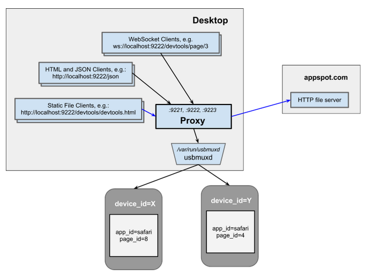

Google BSD license <https://developers.google.com/google-bsd-license>   
Copyright 2012 Google Inc.  <wrightt@google.com>

iOS WebKit Debug Proxy Design
=============================

See the [README.md](README) for an overview.

Source
------

- [src/ios_webkit_debug_proxy_main.c](src/ios_webkit_debug_proxy_main.c)   
   \- The "main"   

- [src/ios_webkit_debug_proxy.c](src/ios_webkit_debug_proxy.c)    
   \- WebInspector to WebKit Remote Debugging Protocol translator   
   \- See [examples/wdp_client.js](examples/wdp_client.js) and <http://localhost:9221>   

- [src/webinspector.c](src/webinspector.c)   
   \- iOS WebInspector library   
   \- See [examples/wi_client.c](examples/wi_client.c)
   \- See [src/rpc.c](src/rpc.c) parser

- [src/device_listener.c](src/device_listener.c)   
   \- iOS device add/remove listener   
   \- See [examples/dl_client.c](examples/dl_client.c)   

- [src/websocket.c](src/websocket.c)   
   \- A generic WebSocket library   
   \- Uses base64.c and sha1.c from [PolarSSL](http://www.polarssl.org)   
   \- See [examples/ws_echo1.c](examples/ws_echo1.c) and [examples/ws_echo2.c](examples/ws_echo2.c)

- Utilities:   
   \- [src/char_buffer.c](src/char_buffer.c) byte buffer   
   \- [src/hash_table.c](src/hash_table.c) dictionary   
   \- [src/port_config.c](src/port_config.c) parses device_id:port config files   
   \- [src/socket_manager.c](src/socket_manager.c) select-based socket controller   

Architecture
------------

The high-level design is shown below:

The various clients are shown below:

The major components of the ios_webkit_debug_proxy are:

  1. A device_listener that listens for iOS device add/remove events
  1. A (port, webinspector) pair for each device, e.g.:   
     - [(port 9222 <--> iphoneX's inspector),
     -  (port 9223 <--> iphoneY's inspector), ...]
  1. Zero or more active WebSocket clients, e.g.:
     - [websocketA is connected to :9222/devtools/page/7, ...]
  1. A socket_manager that handles all the socket I/O

The code is object-oriented via the use of structs and function pointers.
For example, the device_listener struct defines two "public API" functions:

    dl_status (*start)(dl_t self);
    dl_status (*on_recv)(dl_t self, const char *buf, );

and three "abstract" callback functions:

    dl_status (*send)(dl_t self, const char *buf, size_t length);
    dl_status (*on_attach)(dl_t self, const char *device_id);
    dl_status (*on_detach)(dl_t self, const char *device_id);

plus a field for client use:

    void *state;

For example, [examples/dl_client.c](examples/dl_client.c) creates a listener and sets the missing callbacks:

    int fd = dl_connect();
    dl_t dl = dl_new(); // sets the "start" and "on_recv" functions
    dl->state = fd;     // for use by "my_send"
    dl->send = my_send; // --> send((int)dl->state, buf, length);
    dl->on_attach = my_on_attach; // --> printf("%s", device_id);
    dl->on_detach = my_on_detach; // --> ditto

then does:

    dl->start();

Lastly, the client forwards all socket input to the listener's "on_recv"
handler:

    char buf[1024];
    while (1) {
       int len = recv(fd, buf, 1024);
       if (dl->on_recv(dl, buf, len)) break;
    }

where "on_recv" buffers the input and calls our "my_on_message" when it has a
full message.

Note that the "on_recv" and "send" functions abstract the I/O from the
interface, which simplifies debugging and unit testing.

The detailed design is shown below:

Lines in red are controlled by the main "ios_webkit_debug_proxy".  For example, although the figure shows a direct red line from the socket_manager's "on_recv" to the ios_webkit_debug_proxy's handler, this is implemented as a callback through ios_webkit_debug_proxy_main's "iwdpm_on_recv(...)".  This design isolate the components from one another and simplifies both offline and per-component unit testing.

The code is single-threaded and uses non-blocking I/O.  Instead of having a thread per socket that does blocking reads, the single  socket_manager's non-blocking select forwards data to the "on_recv" function of websocket/webinspector/etc.  This improves system scalability and makes it easier to debug and unit test.

